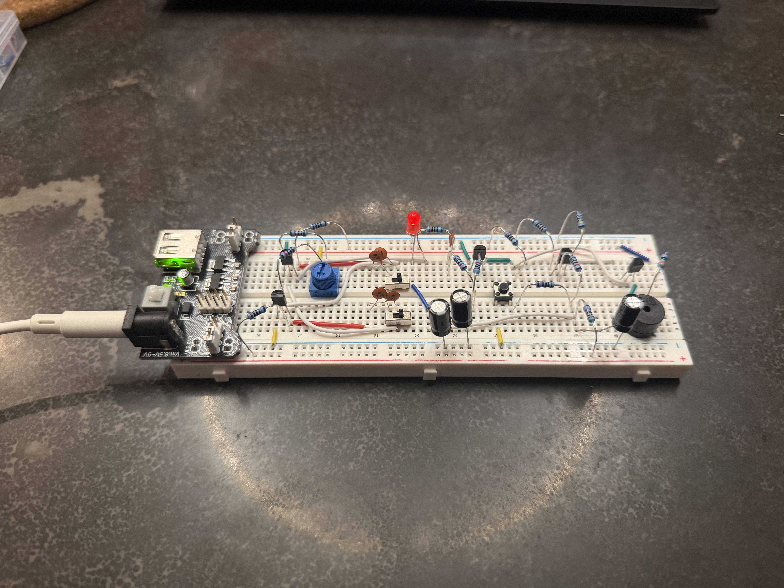
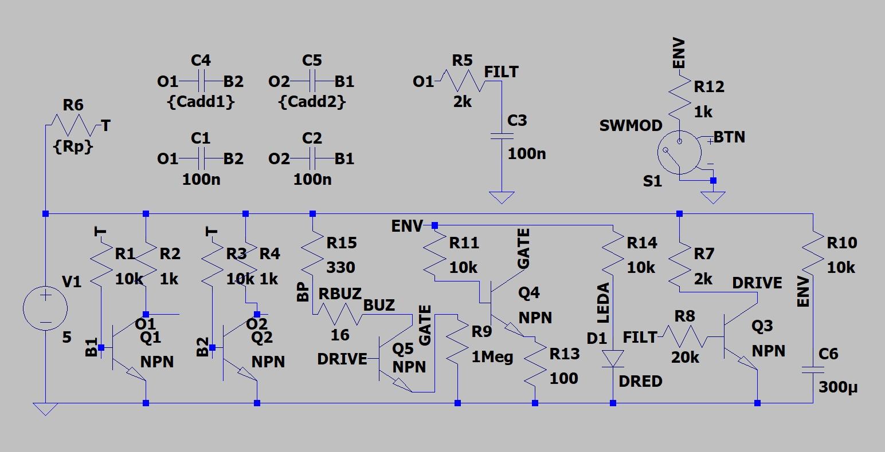
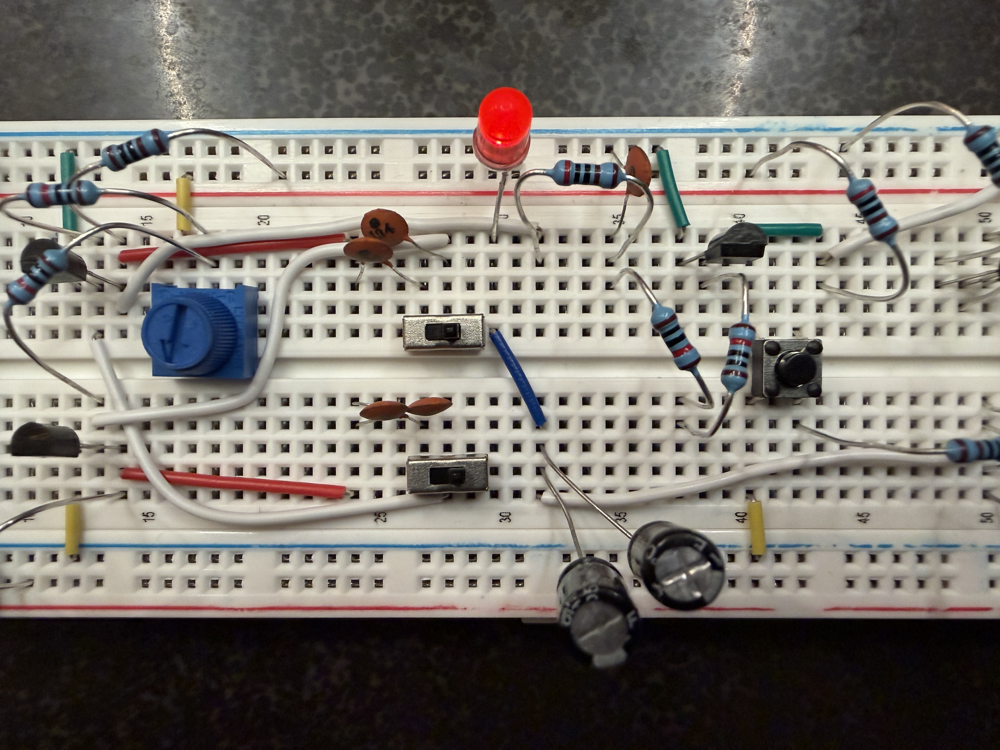
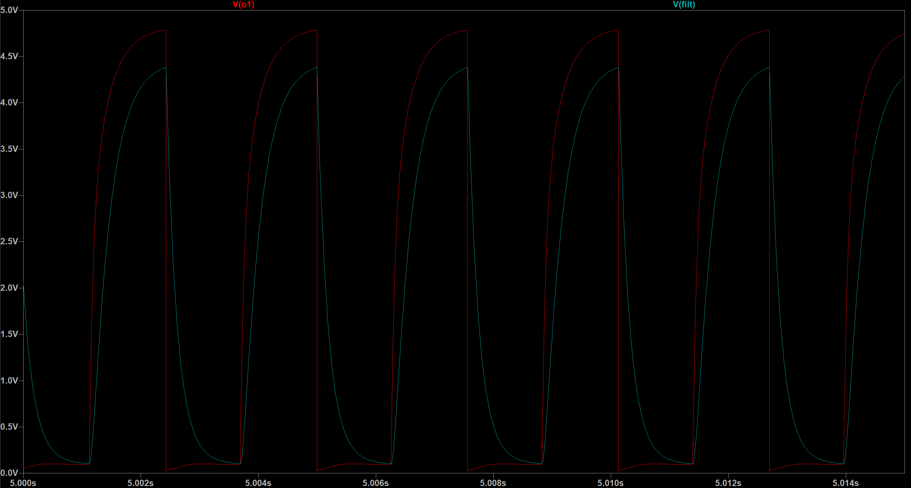
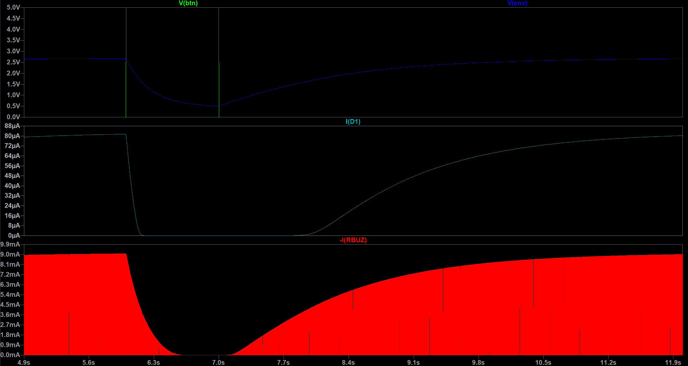
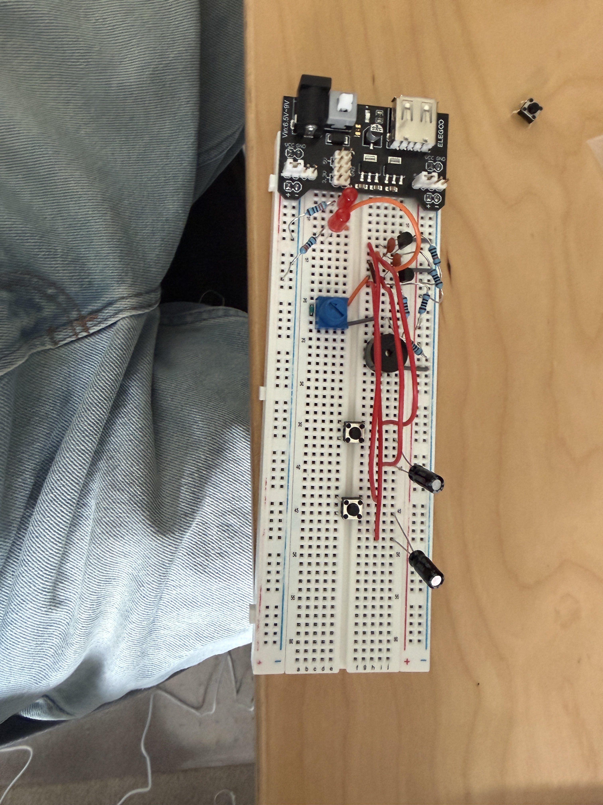

# Vision-Configured Analog Oscillator

A hand-controlled analog sound circuit, with a custom CNN being developed to read its potentiometer and switches from photographs. The breadboard and LTspice model are complete; the CV pipeline has been trained on 40 photos and still needs testing on an independent capture session. Circuit calibration and the CV-to-LTspice controller remain unfinished.

## Demonstration

The completed 5 V breadboard oscillator provides three persistent controls: one potentiometer and two independently switched timing capacitors. A momentary button discharges an RC envelope, gradually reducing the buzzer-driver current while the LED fades. Releasing the button allows both to recover.

- [Watch the complete hardware demonstration](hardware/media/hardware-demo.mp4)
- [Watch the envelope and LED close-up](hardware/media/envelope-fade-closeup.mp4)

## Circuit overview

The core is a 5 V two-transistor astable multivibrator. A nominal 10 kΩ potentiometer changes the shared timing resistance, while each maintained switch adds a 100 nF capacitor to one side of the timing network. Together, the switches provide four timing configurations, including symmetric and asymmetric waveforms.

The `O1` output passes through a 2 kΩ/100 nF low-pass filter with a nominal cutoff near 796 Hz. Q3 isolates this filtered signal from the output stage. Q5 drives the passive buzzer, while Q4 controls Q5’s emitter-return path from the `ENV` voltage.

Holding the momentary button discharges the 300 µF envelope through 1 kΩ, reducing buzzer current and fading the LED. After release, the envelope recharges through 10 kΩ and both outputs recover.

## LTspice simulation

The final circuit was simulated in LTspice 26.0.2. The reference run uses `Rp = 5.1 kΩ`, with both additional timing capacitors disconnected; `1 pF` represents each open switch. A 12-second transient simulation applies a one-second button hold from 6–7 seconds.

- [Open the LTspice schematic](ltspice/analog-oscillator-v8.asc)
- [View the simulation results](ltspice/simulation-results.txt)

### Filter response

The `FILT` waveform has slower edges, lower amplitude, and phase delay relative to the raw `O1` waveform.

### Envelope response

The button discharges `ENV`, reducing both LED current and modeled buzzer current. After release, the 300 µF envelope recharges gradually.

## Results

The final reference simulation produced:

| Measurement | Result |
|---|---:|
| Normal buzzer RMS current | 5.441 mA |
| Held-button buzzer RMS current | 3.094 µA |
| Recovered buzzer RMS current | 5.362 mA |
| Normal oscillator frequency | 389.428 Hz |
| Held-button oscillator frequency | 389.508 Hz |
| Simulated frequency change | 0.0204% |

The model predicts approximately a 99.94% reduction in buzzer RMS current while the button is held, without materially changing oscillator frequency. This supports the intended separation between the timing oscillator and the output envelope.

The physical breadboard reproduces the control behavior qualitatively: the potentiometer and both timing switches change the tone, while the button fades the LED and suppresses the buzzer before gradual recovery. Physical frequency and waveform measurements have not yet been collected with an oscilloscope.

## Design history

This project began as a physics-class demonstration of a two-transistor astable multivibrator. The potentiometer replaced one timing resistor, while two momentary buttons independently connected additional capacitors. The oscillator drove both a passive buzzer and two alternating LEDs. Holding either button lowered the frequency, and the added capacitance slowed the frequency enough for the LEDs’ alternating blinking to become directly visible.

- [Watch the original prototype demonstration](hardware/history/original-prototype-demo.mp4)

| Stage | Main change | Result |
|---|---|---|
| Physics-class prototype | Used a potentiometer in one timing branch, two button-switched capacitors, two alternating LEDs, and a passive buzzer | Demonstrated how resistance and capacitance change audible pitch and visible oscillation rate |
| Rebuilt oscillator | Changed to a shared timing potentiometer, two maintained capacitor switches, and a fixed RC-filtered buzzer path | Produced four persistent timing configurations suitable for simulation and later visual recognition |
| Output-control experiments | Tested raw/filtered signal mixing, a volume-accent path, a button-controlled pitch drop, and several RC-envelope arrangements | Raw/filter mixing and the volume accent did not create a distinct effect; the pitch drop worked but repeated the function of the timing capacitors; early envelope circuits loaded or altered the oscillator instead of independently controlling the output |
| Final v8 | Isolated the filtered signal with Q3, used Q4 and Q5 for envelope-controlled buzzer current, increased the envelope to 300 µF, and added an LED indicator | Kept the oscillator frequency nearly unchanged during the button action while making the envelope directly visible |

The current build keeps the original project’s oscillator, passive buzzer, and adjustable timing concept, but separates oscillator timing from the momentary output effect.

## Limitations

- The physical circuit has been tested by sound and visible LED behavior, but its frequency, duty cycle, and node voltages have not yet been measured with an oscilloscope.
- The potentiometer is nominally 10 kΩ but has not yet been calibrated from physical angle to measured resistance.
- LTspice uses generic NPN models and represents the passive buzzer as a 16 Ω resistive load. The simulation therefore predicts electrical behavior, not exact loudness or acoustic response.
- The LED shows the envelope more clearly than the passive buzzer reproduces it acoustically.
- The current breadboard is a single hand-wired prototype, so component tolerances and wiring parasitics are not characterized.
- Computer-vision results so far use the same photographs for training and evaluation. They establish training fit, not accuracy on new photographs; an independent capture session is still needed.

## Computer-vision phase

The implemented pipeline is designed to test whether a compact CNN can recover the persistent control configuration of this fixed breadboard from a saved photograph. It estimates board rotation, potentiometer center and orange-tape pointer tip, and the independent states of the two maintained switches. The momentary button, LED brightness, and buzzer state are not targets.

The primary implementation is a small PyTorch CNN trained from scratch, with a shared encoder, sine/cosine orientation regression, two switch logits, and half-resolution center/tip heatmaps. A separate Python controller will later combine accepted predictions with measured potentiometer calibration and a verified switch-to-capacitor mapping, then run LTspice to estimate frequency and waveform behavior.

A ten-photo capture preflight checked control visibility at the planned `576 x 768` input size. The first 40-photo training session then exposed problems that synthetic execution tests had missed: background-dominated heatmap loss, small-batch normalization mismatch, and loss of switch-position information. The revised model passed an eight-photo overfit check. This is evidence that the implementation can learn the supplied labels, not that it generalizes to new photographs.

See the [experiment history](docs/cv-experiments.md) for run-by-run changes, results, and unsuccessful diagnostics. The [computer-vision implementation and usage guide](docs/computer-vision-plan.md) and [dataset protocol](data/README.md) cover commands, conventions, labels, and evaluation boundaries.

The [first annotated capture session](data/pilot-s01/README.md) includes all 40 processed training photographs, unchanged manual labels, and a portable manifest. Image metadata has been removed. This makes the training inputs inspectable; it does not supply independent validation data.

## Repository contents

- `hardware/media/`: current breadboard photographs and demonstrations.
- `hardware/history/`: the original physics-class prototype.
- `ltspice/`: the editable schematic, simulation results, and waveform images.
- `src/oscillator_cv/`: the computer-vision package and `oscillator-cv` CLI.
- `tests/`: unit and command-level integration tests, including synthetic CPU train/resume/predict coverage.
- `scripts/overfit_check.py`: a bounded real-photo training-fit diagnostic with prediction overlays.
- `data/pilot-s01/`: the published 40-photo training session, labels, and portable manifest.
- `docs/` and `data/`: the computer-vision implementation guide and dataset protocol.
- `pyproject.toml` and `uv.lock`: the Python 3.12 environment definition and lockfile.

Generated LTspice `.raw`, `.db`, `.log`, and operating-point files are excluded because they are not needed to inspect or rerun the schematic. Full-resolution originals, private working datasets, training runs, and model checkpoints remain excluded from Git. The reviewed processed pilot session is included separately under `data/pilot-s01/`.
